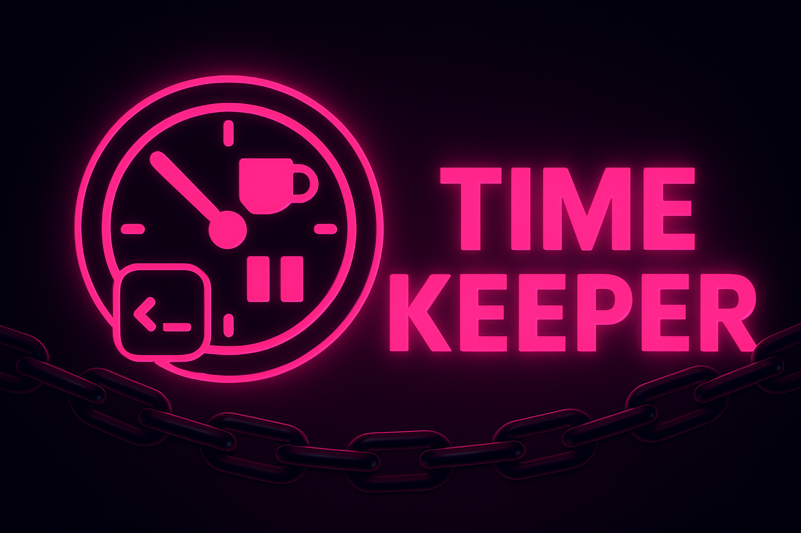

# ⏰ Time Keeper - VSCode Extension

**Boost your productivity and protect your health!** 

Time Keeper forces you to take regular breaks by temporarily disabling your VSCode editor, helping prevent burnout and eye strain while maintaining peak coding performance.

<p align="center">
  
</p>

[](https://marketplace.visualstudio.com/items?itemName=kpab.time-keeper)
[](https://marketplace.visualstudio.com/items?itemName=kpab.time-keeper)
[](https://marketplace.visualstudio.com/items?itemName=kpab.time-keeper)

## Features

- **Pomodoro-style Timer**: Set custom work and break durations
- **Complete Editor Lockdown**: All editors become read-only during breaks
- **Visual Break Screen**: Semi-transparent overlay (customizable opacity)
- **Multi-window Sync**: All VSCode windows sync break times
- **Status Bar Timer**: Always visible countdown
- **Emergency Unlock**: Override break time when absolutely necessary

## Usage

1. **Start Timer**: 
   - Click ⏰ in status bar
   - Or Command Palette: `Time Keeper: Start Timer`
   - Default: 25 minutes work, 5 minutes break

2. **Settings**: 
   - Click ⚙️ in status bar for quick settings
   - Or Command Palette: `Time Keeper: Show Menu`

3. **Emergency Unlock**: 
   - Command Palette: `Time Keeper: Emergency Unlock`
   - Use only when absolutely necessary!

## Settings

Configure via status bar ⚙️ menu or VSCode settings:

- `timeKeeper.workDuration`: Work duration in minutes (default: 25)
- `timeKeeper.breakDuration`: Break duration in minutes (default: 5)
- `timeKeeper.overlayOpacity`: Break screen opacity 0.5-1.0 (default: 0.95)

## How It Works

When break time starts:
- All editors become read-only
- Dark overlay covers the screen
- Timer shows remaining break time
- Helpful tips encourage healthy habits

**Try it out:**
1. Click ⏰ to start the timer
2. During work: displays "💻 Work: 24:59"
3. During break: displays "☕ Break: 04:59" and disables editors
4. Automatically returns to work mode after break

## Why Time Keeper?

- **Prevent Burnout**: Regular breaks maintain mental freshness
- **Protect Your Eyes**: Follow the 20-20-20 rule automatically  
- **Increase Focus**: Time constraints boost concentration
- **Improve Health**: Forced movement breaks combat sedentary lifestyle
- **Boost Productivity**: Well-rested developers write better code

## Installation

1. Open VSCode
2. Go to Extensions (Ctrl+Shift+X)
3. Search for "Time Keeper"
4. Click Install

Or install via command line:
```bash
code --install-extension kpab.time-keeper
```

## Contributing

Found a bug or have a feature request? 
- 🐛 [Report Issues](https://github.com/kpab/time-keeper/issues)
- 💡 [Request Features](https://github.com/kpab/time-keeper/issues)
- 🤝 [Contribute Code](https://github.com/kpab/time-keeper)

## Development

```bash
# Clone the repository
git clone https://github.com/kpab/time-keeper.git
cd time-keeper

# Install dependencies
npm install

# Compile TypeScript
npm run compile

# Watch mode for development
npm run watch
```

## Requirements

- VSCode 1.74.0 or higher

## License

MIT - see [LICENSE](LICENSE) file for details

---

⭐ **Love Time Keeper?** Give it a star on [GitHub](https://github.com/kpab/time-keeper) and rate it on the [Marketplace](https://marketplace.visualstudio.com/items?itemName=kpab.time-keeper)!